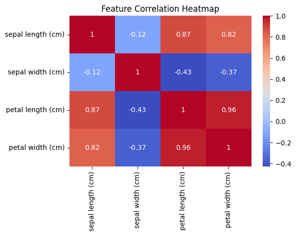
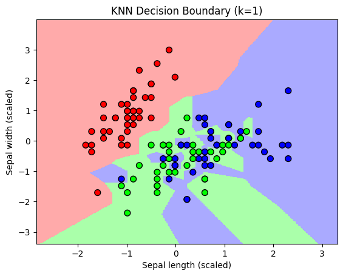

# KNN-Iris-Classification

---

##  Project Overview
This project demonstrates the **K-Nearest Neighbors (KNN)** algorithm for classifying the famous **Iris dataset**.  
The dataset contains flower measurements and their species, and KNN is used to predict the species based on the input features.  

The project includes:
- Data exploration & visualization
- Feature correlation analysis
- Model training & evaluation
- Decision boundary visualization

---

## Dataset Description
The **Iris dataset** is a classic dataset in machine learning.  
It contains **150 samples** with 4 numerical features:
1. Sepal Length (cm)
2. Sepal Width (cm)
3. Petal Length (cm)
4. Petal Width (cm)

Target labels:
- **Setosa**
- **Versicolor**
- **Virginica**

---

## Correlation Heatmap
The heatmap below shows the **pairwise correlation** between features.  
It helps us understand how features are related to each other.  
For example:
- **Petal length** and **petal width** are highly correlated.
- **Sepal width** has a weak correlation with other features.

---

## KNN Decision Boundary
The decision boundary visualization helps understand **how KNN separates different species** based on features.  
Here, **k = 1** gives a perfect classification for the training dataset.

---

## Tech Stack
- **Python**
- **Pandas, NumPy** (Data Handling)
- **Matplotlib, Seaborn** (Visualization)
- **Scikit-learn** (KNN Implementation)
